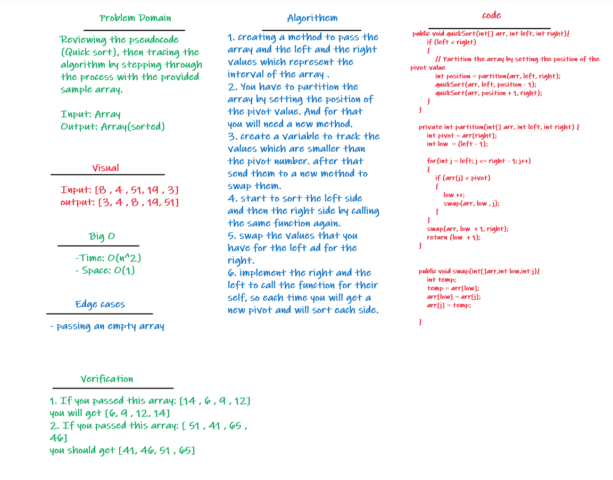

# Challenge Summary
Reviewing the pseudocode below, then tracing the algorithm by stepping through the process with the provided sample array. Documenting the explanation by creating a blog article that shows the step-by-step output after each iteration through some sort of visual.

```
ALGORITHM QuickSort(arr, left, right)
    if left < right
        // Partition the array by setting the position of the pivot value
        DEFINE position <-- Partition(arr, left, right)
        // Sort the left
        QuickSort(arr, left, position - 1)
        // Sort the right
        QuickSort(arr, position + 1, right)

ALGORITHM Partition(arr, left, right)
    // set a pivot value as a point of reference
    DEFINE pivot <-- arr[right]
    // create a variable to track the largest index of numbers lower than the defined pivot
    DEFINE low <-- left - 1
    for i <- left to right do
        if arr[i] <= pivot
            low++
            Swap(arr, i, low)

     // place the value of the pivot location in the middle.
     // all numbers smaller than the pivot are on the left, larger on the right.
     Swap(arr, right, low + 1)
    // return the pivot index point
     return low + 1

ALGORITHM Swap(arr, i, low)
    DEFINE temp;
    temp <-- arr[i]
    arr[i] <-- arr[low]
    arr[low] <-- temp
```

## Whiteboard Process

## Approach & Efficiency
- **Big O**
- Time: O(n^2)
- Space: O(n)

## Solution

Table of contents | link 
--------------- | --------------- 
Quick Sort code | [Quick Sort code](app/src/main/java/codeChallenge28/QuickSort.java)
Test Quick Sort code | [Test Quick Sort code](app/src/test/java/codeChallenge28/AppTest.java)
BLOG | [BLOG.md](BLOG.md)